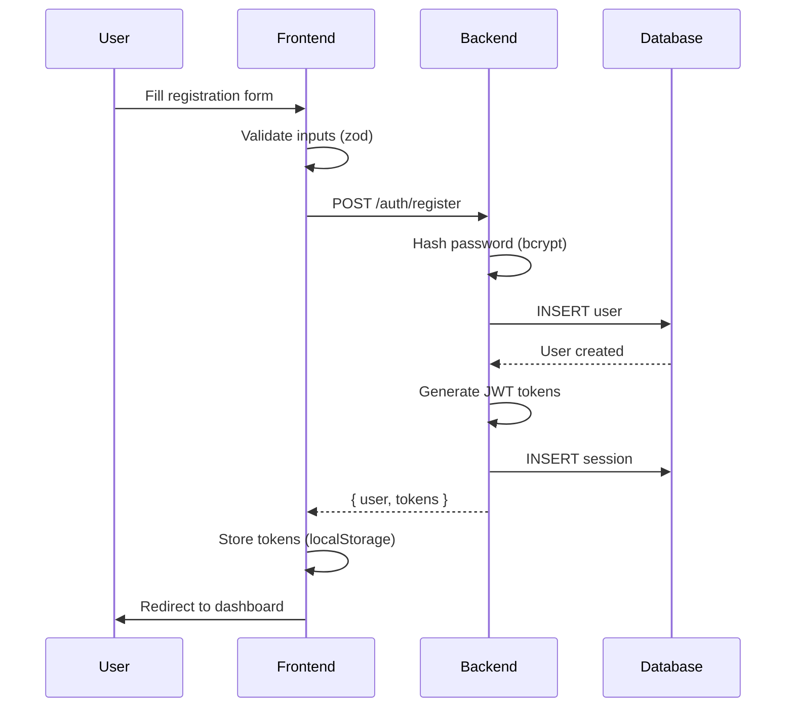
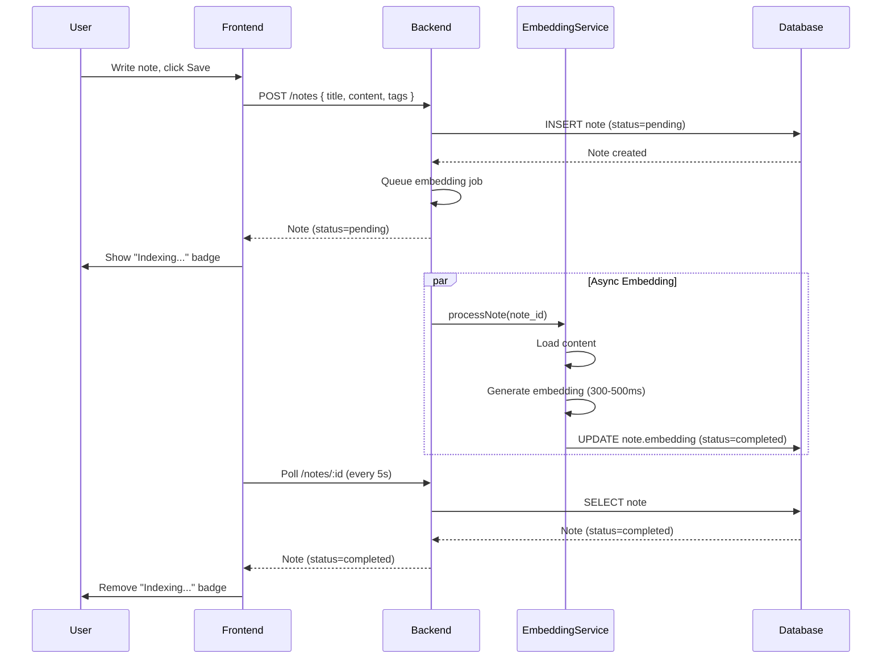
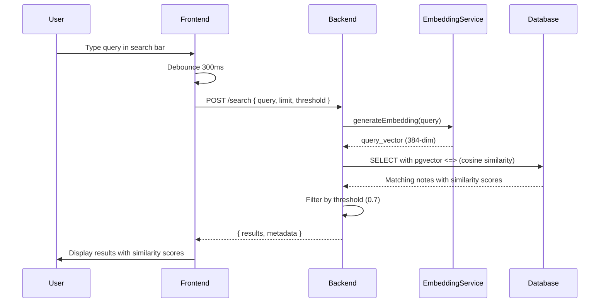
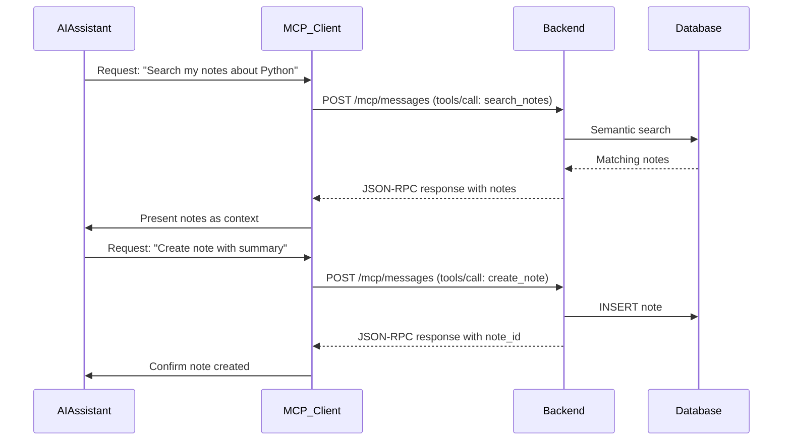
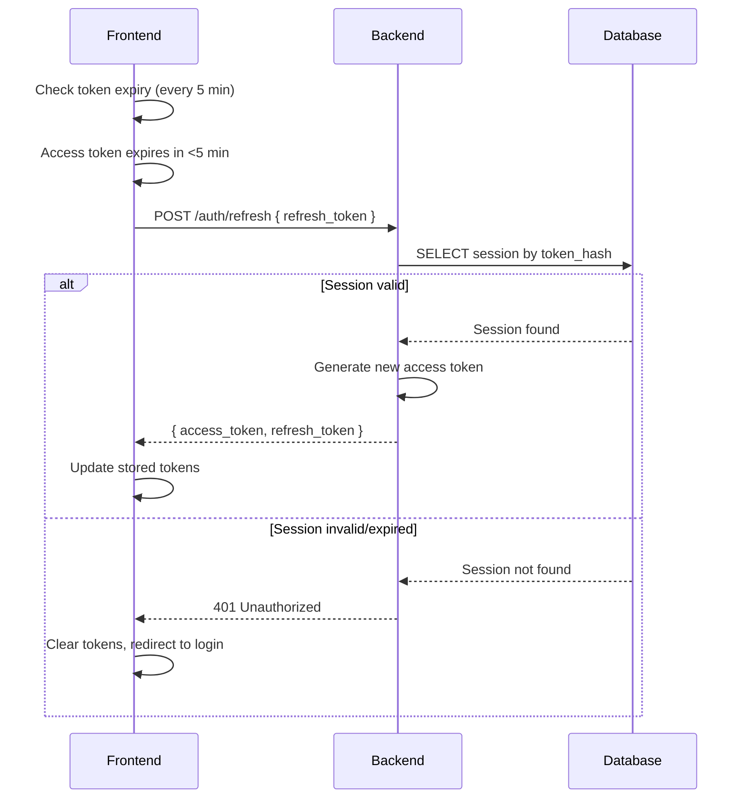
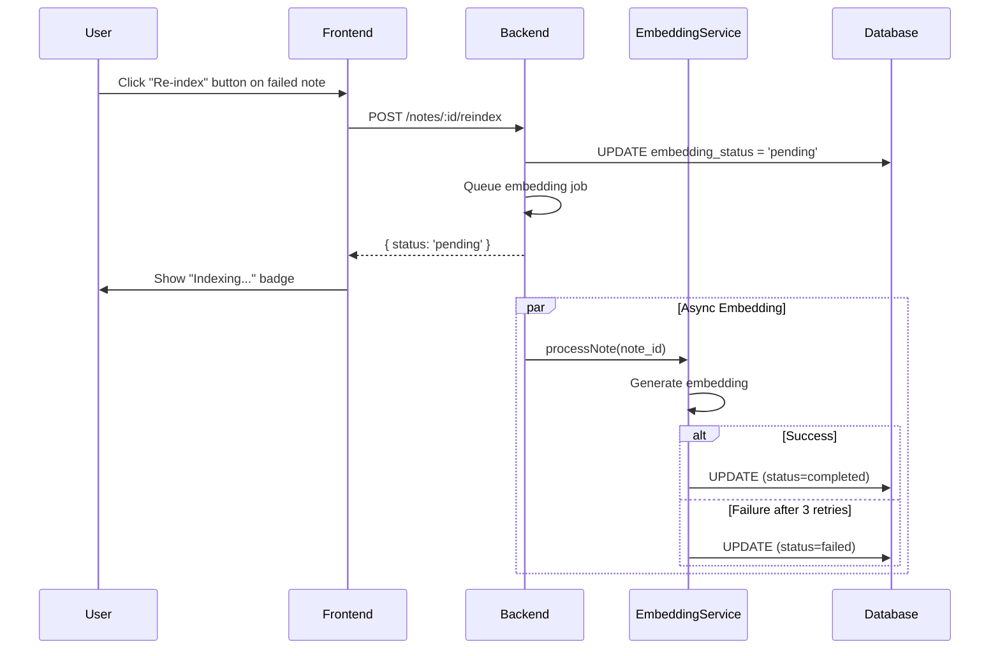

# Core Workflows

This section describes the critical user flows and system processes, showing how components interact to deliver functionality.

## 1. User Registration Flow



**Steps:**
1. User fills form: name, email, password, accept terms
2. Frontend validates with `RegisterSchema` (zod)
3. Backend hashes password with bcrypt (cost: 12)
4. Backend creates user record with `terms_accepted_at = NOW()`
5. Backend generates access token (1h) and refresh token (30d)
6. Backend creates session record with hashed refresh token
7. Frontend stores tokens in localStorage
8. Frontend redirects to `/dashboard`

**Error Handling:**
- Email already exists → Show "Email already registered" error
- Weak password → Show password requirements
- Terms not accepted → Disable submit button

---

## 2. Create Note with Embedding Flow



**Steps:**
1. User writes note in editor, clicks "Save"
2. Frontend validates and sends POST request
3. Backend creates note with `embedding_status = 'pending'`
4. Backend queues async embedding job (returns immediately)
5. Frontend shows note with "Indexing..." badge
6. **Async:** EmbeddingService generates 384-dim vector
7. **Async:** Database updated with embedding, status = 'completed'
8. Frontend polls every 5 seconds until status = 'completed'

**Retry Logic:**
- If embedding fails (timeout, OOM), retry 3 times with exponential backoff
- After 3 failures, set `embedding_status = 'failed'`
- User can manually trigger re-index via dashboard button

---

## 3. Semantic Search Flow



**Steps:**
1. User types query in search bar
2. Frontend debounces input (300ms) to avoid excessive requests
3. Backend generates embedding for query string
4. Database executes vector similarity search:
   ```sql
   SELECT *, 1 - (embedding <=> $1) AS similarity
   FROM notes
   WHERE user_id = $2
     AND embedding_status = 'completed'
     AND 1 - (embedding <=> $1) >= 0.7
   ORDER BY embedding <=> $1
   LIMIT 10
   ```
5. Results ranked by similarity (0.0 to 1.0)
6. Frontend displays with similarity percentage

**Performance:**
- Query embedding: 300-500ms
- Vector search: <50ms (HNSW index)
- Total: <600ms (meets NFR2: <2s)

---

## 4. MCP Integration Flow



**MCP Tools:**
1. **search_notes** - AI searches user's knowledge base
2. **create_note** - AI creates notes from conversation
3. **update_note** - AI updates existing notes
4. **list_tags** - AI views available tags

**Transport:** stdio (local) or SSE (remote)

---

## 5. JWT Token Refresh Flow



**Steps:**
1. Frontend checks token expiry every 5 minutes (background job)
2. If access token expires in <5 minutes, trigger refresh
3. Backend validates refresh token hash against sessions table
4. If valid, issue new access token (optionally rotate refresh token)
5. Frontend updates localStorage with new tokens
6. If invalid, logout user and redirect to login

---

## 6. Manual Re-indexing Flow



**Trigger:** User clicks "Re-index" button on notes with `embedding_status = 'failed'`

---

