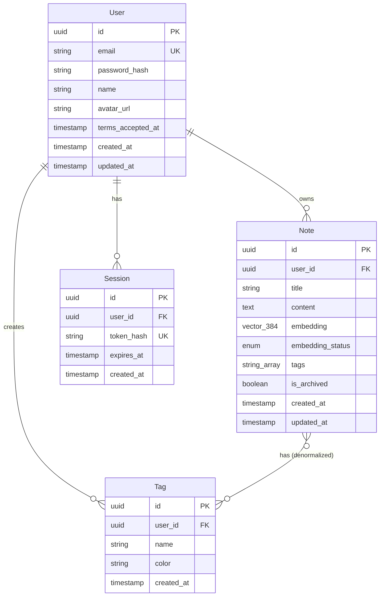

# Data Models

This section defines the core data models and their relationships. Models are defined using **Zod schemas** (shared between frontend and backend) and implemented in **PostgreSQL with pgvector** via Drizzle ORM.

## Model: User

**Purpose:** Represents authenticated users who own notes. Supports basic authentication with JWT tokens. Self-hosted system assumes single-user or small team usage.

**Key Attributes:**
- `id`: UUID - Primary key, auto-generated
- `email`: string - Unique email address for login
- `password_hash`: string - Bcrypt-hashed password (never exposed to frontend)
- `name`: string - Display name
- `created_at`: timestamp - Account creation timestamp
- `updated_at`: timestamp - Last profile update timestamp

### Zod Schema

```typescript
// shared/schemas/user.ts
import { z } from 'zod';

export const UserSchema = z.object({
  id: z.string().uuid(),
  email: z.string().email(),
  name: z.string().min(1).max(100),
  avatar_url: z.string().url().optional(), // Optional profile picture URL
  terms_accepted_at: z.date().optional(), // Timestamp when user accepted terms
  created_at: z.date(),
  updated_at: z.date(),
});

// Frontend-safe user (no password_hash)
export type User = z.infer<typeof UserSchema>;

// Backend-only user with password
export const UserWithPasswordSchema = UserSchema.extend({
  password_hash: z.string(),
});

export type UserWithPassword = z.infer<typeof UserWithPasswordSchema>;

// Registration/login schemas
export const RegisterSchema = z.object({
  email: z.string().email(),
  password: z.string().min(8).max(100),
  name: z.string().min(1).max(100),
});

export const LoginSchema = z.object({
  email: z.string().email(),
  password: z.string(),
});
```

### Drizzle Schema (PostgreSQL)

```typescript
// backend/src/db/schema/users.ts
import { pgTable, uuid, varchar, timestamp } from 'drizzle-orm/pg-core';

export const users = pgTable('users', {
  id: uuid('id').primaryKey().defaultRandom(),
  email: varchar('email', { length: 255 }).notNull().unique(),
  password_hash: varchar('password_hash', { length: 255 }).notNull(),
  name: varchar('name', { length: 100 }).notNull(),
  created_at: timestamp('created_at').defaultNow().notNull(),
  updated_at: timestamp('updated_at').defaultNow().notNull(),
});
```

### Relationships

- **User → Notes:** One-to-many (one user owns many notes)
- **User → Tags:** One-to-many (one user owns many tags)

---

## Model: Note

**Purpose:** Core entity representing a markdown note with metadata and vector embeddings for semantic search. Notes are the primary data accessed via MCP protocol.

**Key Attributes:**
- `id`: UUID - Primary key
- `user_id`: UUID - Foreign key to users table
- `title`: string - Note title (required, max 200 chars)
- `content`: text - Markdown content (unlimited length)
- `embedding`: vector(384) - pgvector column for semantic search
- `embedding_status`: enum - Status of embedding generation ('pending', 'processing', 'completed', 'failed')
- `tags`: string[] - Array of tag names (denormalized for query performance)
- `is_archived`: boolean - Soft delete flag
- `created_at`: timestamp
- `updated_at`: timestamp

### Zod Schema

```typescript
// shared/schemas/note.ts
import { z } from 'zod';

export const EmbeddingStatusSchema = z.enum(['pending', 'processing', 'completed', 'failed']);

export const NoteSchema = z.object({
  id: z.string().uuid(),
  user_id: z.string().uuid(),
  title: z.string().min(1).max(200),
  content: z.string(),
  embedding_status: EmbeddingStatusSchema,
  tags: z.array(z.string()).default([]),
  is_archived: z.boolean().default(false),
  created_at: z.date(),
  updated_at: z.date(),
});

export type Note = z.infer<typeof NoteSchema>;

// Create/update schemas (frontend → backend)
export const CreateNoteSchema = z.object({
  title: z.string().min(1).max(200),
  content: z.string(),
  tags: z.array(z.string()).optional(),
});

export const UpdateNoteSchema = CreateNoteSchema.partial();

export type CreateNote = z.infer<typeof CreateNoteSchema>;
export type UpdateNote = z.infer<typeof UpdateNoteSchema>;
```

### Drizzle Schema (PostgreSQL)

```typescript
// backend/src/db/schema/notes.ts
import { pgTable, uuid, varchar, text, timestamp, boolean, vector } from 'drizzle-orm/pg-core';
import { users } from './users';

export const notes = pgTable('notes', {
  id: uuid('id').primaryKey().defaultRandom(),
  user_id: uuid('user_id').references(() => users.id).notNull(),
  title: varchar('title', { length: 200 }).notNull(),
  content: text('content').notNull(),
  embedding: vector('embedding', { dimensions: 384 }), // pgvector column
  embedding_status: varchar('embedding_status', { length: 20 }).notNull().default('pending'),
  tags: text('tags').array().notNull().default([]), // PostgreSQL text array
  is_archived: boolean('is_archived').notNull().default(false),
  created_at: timestamp('created_at').defaultNow().notNull(),
  updated_at: timestamp('updated_at').defaultNow().notNull(),
});

// Indexes for performance
export const notesIndexes = {
  user_id_idx: index('notes_user_id_idx').on(notes.user_id),
  embedding_idx: index('notes_embedding_idx').using('hnsw', notes.embedding.cosineDistance()),
  tags_idx: index('notes_tags_idx').using('gin', notes.tags),
  created_at_idx: index('notes_created_at_idx').on(notes.created_at.desc()),
};
```

### Relationships

- **Note → User:** Many-to-one (many notes belong to one user)
- **Note → Tags:** Many-to-many (denormalized as array for simplicity)

---

## Model: Tag

**Purpose:** Simple categorization system for notes. Tags are lightweight labels that help organize and filter notes. Denormalized in notes table for query performance.

**Key Attributes:**
- `id`: UUID - Primary key
- `user_id`: UUID - Foreign key to users
- `name`: string - Tag name (unique per user)
- `color`: string - Hex color for UI display (optional)
- `created_at`: timestamp

### Zod Schema

```typescript
// shared/schemas/tag.ts
import { z } from 'zod';

export const TagSchema = z.object({
  id: z.string().uuid(),
  user_id: z.string().uuid(),
  name: z.string().min(1).max(50),
  color: z.string().regex(/^#[0-9A-F]{6}$/i).optional(),
  created_at: z.date(),
});

export type Tag = z.infer<typeof TagSchema>;

export const CreateTagSchema = z.object({
  name: z.string().min(1).max(50),
  color: z.string().regex(/^#[0-9A-F]{6}$/i).optional(),
});
```

### Drizzle Schema (PostgreSQL)

```typescript
// backend/src/db/schema/tags.ts
import { pgTable, uuid, varchar, timestamp, unique } from 'drizzle-orm/pg-core';
import { users } from './users';

export const tags = pgTable('tags', {
  id: uuid('id').primaryKey().defaultRandom(),
  user_id: uuid('user_id').references(() => users.id).notNull(),
  name: varchar('name', { length: 50 }).notNull(),
  color: varchar('color', { length: 7 }), // #RRGGBB
  created_at: timestamp('created_at').defaultNow().notNull(),
}, (table) => ({
  // Unique constraint: one user can't have duplicate tag names
  unique_user_tag: unique().on(table.user_id, table.name),
}));
```

### Relationships

- **Tag → User:** Many-to-one
- **Tag ↔ Note:** Many-to-many (via denormalized array in notes.tags)

---

## Model: Session

**Purpose:** Track active JWT sessions for token revocation and security auditing. Enables logout functionality and session management.

**Key Attributes:**
- `id`: UUID - Primary key
- `user_id`: UUID - Foreign key to users
- `token_hash`: string - SHA-256 hash of JWT refresh token
- `expires_at`: timestamp - Session expiry
- `created_at`: timestamp

### Zod Schema

```typescript
// shared/schemas/session.ts
import { z } from 'zod';

export const SessionSchema = z.object({
  id: z.string().uuid(),
  user_id: z.string().uuid(),
  expires_at: z.date(),
  created_at: z.date(),
});

export type Session = z.infer<typeof SessionSchema>;
```

### Drizzle Schema (PostgreSQL)

```typescript
// backend/src/db/schema/sessions.ts
import { pgTable, uuid, varchar, timestamp, index } from 'drizzle-orm/pg-core';
import { users } from './users';

export const sessions = pgTable('sessions', {
  id: uuid('id').primaryKey().defaultRandom(),
  user_id: uuid('user_id').references(() => users.id).notNull(),
  token_hash: varchar('token_hash', { length: 64 }).notNull().unique(),
  expires_at: timestamp('expires_at').notNull(),
  created_at: timestamp('created_at').defaultNow().notNull(),
}, (table) => ({
  user_id_idx: index('sessions_user_id_idx').on(table.user_id),
  expires_at_idx: index('sessions_expires_at_idx').on(table.expires_at),
}));
```

### Relationships

- **Session → User:** Many-to-one (one user can have multiple active sessions)

---

## Complete Entity Relationship Diagram



---

## Database Indexes Strategy

**Performance-Critical Indexes:**

1. **notes.embedding (HNSW):** Fast approximate nearest neighbor search for semantic similarity
2. **notes.tags (GIN):** Fast array containment queries for tag filtering
3. **notes.user_id + created_at:** Composite index for user's recent notes
4. **sessions.token_hash:** Fast session lookup during authentication

**Index Trade-offs:**
- HNSW index for pgvector adds ~30% storage overhead but enables <50ms vector search
- GIN index on tags array adds ~20% overhead but enables instant tag filtering
- Acceptable for knowledge base with estimated <10K notes per user

---
