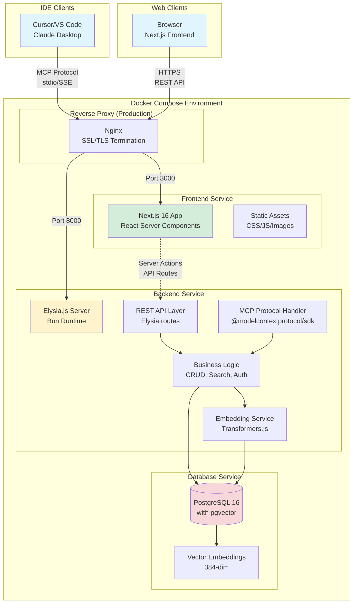

# High Level Architecture

This section establishes the foundational architectural decisions for the BMad-Personal-Vault system, including deployment strategy, repository structure, system diagrams, and core architectural patterns.

## Technical Summary

BMad-Personal-Vault follows a **containerized microservices architecture** with a clear separation between presentation (Next.js frontend), business logic (Elysia.js backend on Bun), and data persistence (PostgreSQL with pgvector). The system is designed for **self-hosted deployment** with Docker Compose, enabling seamless transition from local development to cloud VPS environments. **Unified TypeScript** across the entire stack eliminates language context switching and enables direct type sharing.

The architecture employs a **dual-protocol backend approach** where a single Elysia.js application serves two distinct client types: (1) the Next.js web dashboard via REST API over HTTP/HTTPS, and (2) IDE clients (Cursor, VS Code, Claude Desktop) via the Model Context Protocol using @modelcontextprotocol/sdk over stdio or Server-Sent Events (SSE). This unified backend eliminates data synchronization issues and simplifies deployment topology.

**Frontend-Backend Integration:** The existing Next.js 16 frontend consumes RESTful JSON APIs exposed by the Elysia.js backend. Frontend routes (dashboard, notes CRUD, search) make asynchronous fetch requests to backend endpoints, which handle authentication, business logic, and database access. **Direct Zod schema sharing** ensures frontend and backend use identical type definitions, eliminating API contract drift. The frontend is stateless except for client-side caching and optimistic UI updates.

**Semantic Search Architecture:** All markdown notes are stored in PostgreSQL as plain text with metadata. Upon creation or update, notes are processed through the `paraphrase-multilingual-MiniLM-L12-v2` embedding model (supporting Indonesian and English) via **Transformers.js** (`@xenova/transformers`), generating 384-dimensional vectors stored in pgvector columns. Embedding generation runs asynchronously in the Bun runtime (~300-500ms per note). Search queries are similarly embedded, enabling semantic similarity search via cosine distance operations within PostgreSQL.

**MCP Integration:** The FastMCP server exposes notes as MCP resources accessible via the `@knowledge-base` command in supported IDEs. When invoked, the IDE connects to the MCP server (stdio for local, SSE for remote VPS), retrieves relevant notes based on semantic search, and injects context into the AI conversation. This is a **pull-based reactive model** where AI only accesses data upon explicit user request.

**Deployment Flexibility:** The Docker Compose configuration supports both local development (all services on localhost) and production VPS deployment (with nginx reverse proxy, SSL/TLS termination, and API key authentication). The same Docker images run in both environments with configuration managed via environment variables.

## Platform and Infrastructure Choice

**Platform:** Self-Hosted Docker Compose (Local Development + Cloud VPS)

**Rationale:** Given the self-hosted requirement (NFR3: data privacy) and need for portability between local and cloud environments (NFR1), Docker Compose provides the optimal balance of simplicity and flexibility. Alternative cloud platforms (Vercel, AWS, Azure) were considered but rejected due to cost constraints and vendor lock-in concerns.

**Key Services:**
1. **Frontend Service:** Next.js 16 application served via Node.js runtime (production build)
2. **Backend Service:** Elysia.js application on Bun runtime with REST API and MCP protocol support (@modelcontextprotocol/sdk)
3. **Database Service:** PostgreSQL 16 with pgvector extension for vector similarity search
4. **Reverse Proxy (Production):** Nginx for SSL termination, static asset serving, and load balancing

**Deployment Host and Regions:**
- **Local Development:** Docker Desktop (macOS/Linux/Windows) on developer machine
- **Production VPS:** Any Docker-capable VPS provider (DigitalOcean, Linode, Vultr, Hetzner)
- **Recommended Regions:** Southeast Asia (Singapore, Jakarta) for Indonesian users; optional multi-region for global access
- **Minimum Specs:** 2 vCPU, 4GB RAM, 20GB SSD (Transformers.js embedding model requires ~800MB memory at runtime; Bun runtime adds ~50MB)

**Infrastructure Services:**
- **Container Orchestration:** Docker Compose (v2.x)
- **Container Registry:** Docker Hub or GitHub Container Registry for image distribution
- **Secrets Management:** Docker secrets + environment variables (avoid hardcoding API keys)
- **Backup Strategy:** PostgreSQL pg_dump to S3-compatible storage or local volume snapshots

**Trade-offs vs Alternatives:**
- **vs Kubernetes:** Docker Compose is simpler for solo developers; K8s adds unnecessary complexity for this scale
- **vs Cloud PaaS (Vercel/Railway):** Self-hosted maintains data privacy and avoids subscription costs
- **vs Serverless (AWS Lambda):** FastMCP requires long-running process; cold starts unacceptable for IDE integration

## Repository Structure

**Structure:** Monorepo with pnpm workspaces

**Monorepo Tool:** pnpm workspaces (already in use by frontend)

**Package Organization:**
```
bmad-personal-vault/
├── frontend/                    # Next.js 16 application (existing)
│   ├── app/                     # App Router pages
│   ├── components/              # React components (shadcn/ui)
│   ├── lib/                     # Frontend utilities
│   ├── hooks/                   # Custom React hooks
│   ├── package.json             # Frontend dependencies
│   └── Dockerfile               # Multi-stage build for production
├── backend/                     # Elysia.js on Bun application (to be built)
│   ├── src/
│   │   ├── index.ts             # Elysia app entry point
│   │   ├── api/                 # REST API routes (Elysia handlers)
│   │   ├── mcp/                 # MCP server (@modelcontextprotocol/sdk)
│   │   ├── db/                  # Database client (Drizzle ORM or Prisma)
│   │   ├── services/            # Business logic layer
│   │   ├── ml/                  # Transformers.js embedding service
│   │   └── utils/               # Backend utilities
│   ├── tests/                   # Bun test suite (bun:test)
│   ├── package.json             # Bun dependencies
│   ├── tsconfig.json            # TypeScript config
│   └── Dockerfile               # FROM oven/bun:1
├── shared/                      # Shared types and schemas
│   ├── schemas/                 # Zod schemas (shared by frontend + backend)
│   └── types/                   # Shared TypeScript types
├── docker-compose.yml           # Local development environment
├── docker-compose.prod.yml      # Production overrides
├── .env.example                 # Environment variable template
├── docs/                        # Documentation (existing)
│   ├── architecture.md          # This document
│   ├── prd.md
│   └── front-end-spec.md
├── scripts/                     # Build and deployment scripts
│   ├── dev.sh                   # Start local development
│   ├── build.sh                 # Build Docker images
│   └── deploy.sh                # Deploy to VPS
└── pnpm-workspace.yaml          # Monorepo workspace config
```

**Rationale:**
- **Monorepo Benefits:** Unified versioning, shared types, atomic commits across frontend/backend
- **pnpm Workspaces:** Already used by frontend; Bun backend integrates seamlessly
- **Separate Docker Contexts:** Frontend (Node.js) and backend (Bun) have independent build processes and base images
- **Direct Type Sharing:** Zod schemas defined once in `/shared/schemas`, imported by both frontend and backend with zero code generation

**Simplified Type Sharing Workflow (No Build Tools!):**
1. Define Zod schema in `shared/schemas/note.ts`: `export const NoteSchema = z.object({...})`
2. Backend imports: `import { NoteSchema } from '@/shared/schemas/note'`
3. Frontend imports: `import { NoteSchema } from '@/shared/schemas/note'`
4. TypeScript types inferred automatically: `type Note = z.infer<typeof NoteSchema>`
5. Runtime validation with same schema: `NoteSchema.parse(data)`

**Key Simplification:** No OpenAPI spec, no code generation, no build step. Direct schema sharing via pnpm workspaces.

**Alternative Considered:** Turborepo for better caching and parallel builds, but pnpm workspaces is sufficient for this project scale

## High Level Architecture Diagram



## Architectural Patterns

This section defines the core architectural patterns that guide both frontend and backend development, ensuring consistency and maintainability across the fullstack application.

### Backend Patterns

- **Repository Pattern:** Abstract data access logic behind repository interfaces (e.g., `NotesRepository`, `UserRepository`). This enables testing with mock repositories and potential future database migration without touching business logic.

- **Service Layer Pattern:** Business logic encapsulated in service classes (e.g., `NotesService`, `EmbeddingService`, `SearchService`). Controllers/API routes remain thin, delegating to services for orchestration.

- **Dependency Injection:** Services and repositories injected via Elysia's decorator/plugin system or simple factory functions. Configuration, database connections, and external dependencies managed centrally via environment variables and singleton patterns.

- **Command Query Responsibility Segregation (CQRS) - Lite:** Separate read and write paths for semantic search. Write operations trigger async embedding generation; read operations query precomputed vectors for optimal performance. **Failure Handling:** Retry logic (3 attempts with exponential backoff) for transient failures; persistent failures trigger manual re-index flow via dashboard button.

### Frontend Patterns

- **Component-Based UI:** Reusable React components with TypeScript for type safety. shadcn/ui provides atomic components; feature components compose them into complex UIs.

- **Server Components First:** Leverage Next.js 15+ React Server Components for data fetching and initial rendering. Client components only where interactivity requires browser APIs.

- **Progressive Enhancement:** Core functionality works without JavaScript; enhanced UX with client-side hydration and SPA-style navigation.

- **Optimistic UI Updates:** Immediate UI feedback on user actions (save, delete) with rollback on server errors. Reduces perceived latency.

### Integration Patterns

- **Backend for Frontend (BFF) - Implicit:** Next.js API routes can act as BFF layer if needed, transforming backend responses into frontend-friendly shapes. Initially, direct REST consumption; add BFF layer if transformation logic grows.

- **API Gateway Pattern:** Nginx serves as edge gateway, routing `/api/*` to backend, static assets to frontend. Centralizes SSL, rate limiting, and CORS policies.

- **Event-Driven Indexing:** Note creation/update events trigger async embedding generation. Frontend polls or receives WebSocket notification when indexing completes.

---
