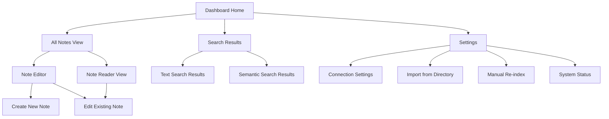
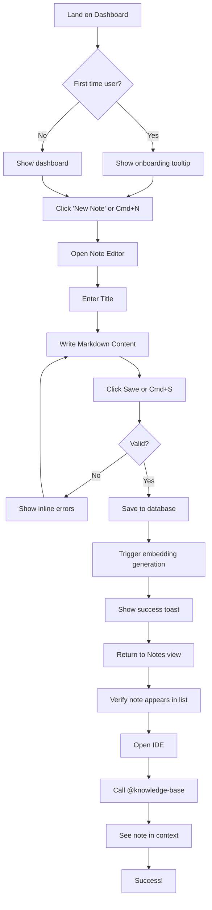
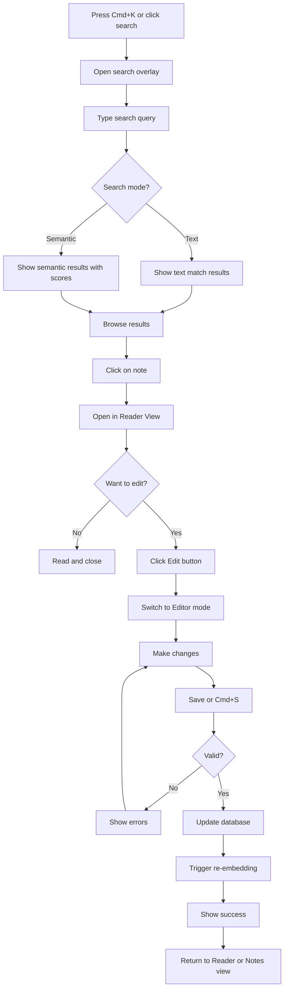
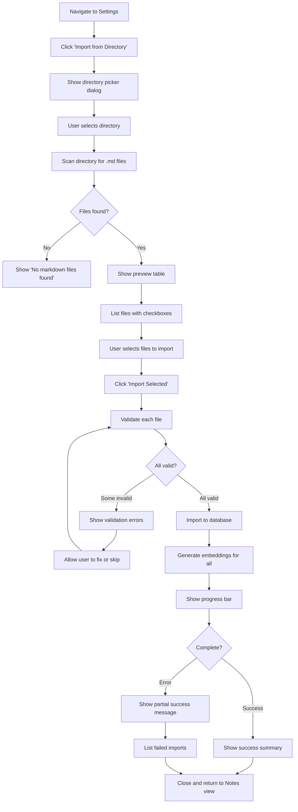

# BMad-Personal-Vault (MCP Knowledge Base) UI/UX Specification

**Document Version:** 1.0
**Last Updated:** February 16, 2026
**Status:** Draft

## Introduction

This document defines the user experience goals, information architecture, user flows, and visual design specifications for BMad-Personal-Vault's user interface. It serves as the foundation for visual design and frontend development, ensuring a cohesive and user-centered experience.

The BMad-Personal-Vault is a self-hosted knowledge management system that enables solo developers to maintain a "second brain" of technical notes, coding standards, and solutions that can be instantly injected into AI conversations through the Model Context Protocol (MCP). The web dashboard serves as the primary interface for creating, organizing, and managing this knowledge base.

### Overall UX Goals & Principles

#### Target User Personas

**The Solo Developer (Primary)**
- **Profile:** Independent software developers working on personal or small-scale projects
- **Technical Level:** Intermediate to advanced developers comfortable with Docker, Git, and modern dev tools
- **Pain Point:** AI assistants give generic advice; needs AI to understand their specific coding standards and past solutions
- **Goals:** Quick access to personal knowledge, maintain consistency across projects, build a permanent knowledge base
- **Environment:** Works primarily in IDE (Cursor/VS Code/Claude Desktop), occasionally switches to browser for management tasks
- **Edge Cases:** May work in low-bandwidth environments, might access from mobile for quick reference

**Note on Scope:** While optimized for solo developers, the system should gracefully support 2-3 person teams sharing a knowledge base. However, collaboration features (comments, permissions, conflict resolution) are explicitly out of scope for MVP.

---

#### Usability Goals

##### 1. Ease of Learning
- **Goal:** New users can add their first note and see it available via MCP within 5 minutes
- **Pass Criteria:** Complete onboarding flow (create note → save → verify in IDE) in ≤5 minutes
- **Fail Criteria:** >7 minutes or requires external documentation to complete

##### 2. Efficiency of Use
- **Goal:** Creating, editing, and organizing notes requires minimal clicks
- **Pass Criteria:**
  - Create new note: ≤2 clicks (New → Save)
  - Edit existing note: ≤3 clicks (Find → Open → Save)
  - Complex operations (bulk tag, reorganize): ≤5 clicks
- **Fail Criteria:** Any core operation requires >5 clicks

##### 3. Error Prevention & Recovery
- **Goal:** Clear validation and confirmation for destructive actions
- **Examples:**
  - Markdown syntax validation on save
  - Confirmation dialog for delete operations
  - Auto-save draft every 30 seconds to prevent data loss
  - Clear error messages when MCP server is unreachable

##### 4. Low Context Switching
- **Goal:** Dashboard interactions are fast and non-intrusive
- **Pass Criteria:** Page load <1s, search results <500ms, save operations <300ms
- **Fail Criteria:** Any operation feels sluggish or blocks user workflow

##### 5. Memorability
- **Goal:** Infrequent users can return after weeks and immediately resume work
- **Pass Criteria:** Returning users complete a task without referring to help/docs
- **Measurement:** Post-return task completion time within 2x of regular users

##### 6. Accessibility
- **Goal:** Interface is usable by keyboard-only navigation and screen readers
- **Standards:** WCAG 2.1 Level AA minimum
- **Key Requirements:** Semantic HTML, ARIA labels, keyboard shortcuts, sufficient color contrast

---

#### Design Principles

##### 1. Developer-First, Not Developer-Only
Use familiar patterns but don't sacrifice usability for technical aesthetics

**In Practice:**
- ✅ Use keyboard shortcuts (Cmd+K for search, Cmd+N for new note)
- ✅ Support markdown shortcuts and code editor keybindings
- ❌ Don't require CLI/config file editing for basic operations
- ❌ Don't assume users memorize obscure command syntax

##### 2. Speed Over Features
Prioritize fast load times and quick operations over fancy animations or complex features

**In Practice:**
- ✅ Use simple page transitions, avoid heavy animations
- ✅ Lazy-load markdown preview only when needed
- ✅ Optimize bundle size aggressively
- ❌ Don't add features that increase page load beyond 1s budget
- ❌ Don't implement real-time collaboration (out of MVP scope)

**Trade-off:** Semantic search (FR3) may be slow on large knowledge bases (1000+ notes). Acceptable up to 2s as per NFR2, but requires loading indicator.

##### 3. Content is King
Let the notes and markdown content take center stage; UI chrome should fade into the background

**In Practice:**
- ✅ Use full-width editor with minimal sidebar
- ✅ Reading mode hides all UI except content
- ✅ Use a rich markdown editor (Monaco or TipTap) for better DX
- ❌ Don't add decorative elements that compete with note content
- ❌ Don't use heavy themes or visual gimmicks

**Technical Note:** Rich editor adds ~200kb to bundle; acceptable trade-off for improved content editing experience.

##### 4. Progressive Disclosure
Start with simple note creation, reveal advanced features as needed

**In Practice:**
- ✅ Basic interface: Title + Markdown editor + Save
- ✅ Advanced features (tags, metadata, manual re-index) behind expandable panel or settings
- ✅ Search starts simple (text match), can upgrade to semantic search with toggle
- ❌ Don't hide critical operations (save, delete) in advanced menus

**Simple vs. Advanced Boundary:**
- **Simple (always visible):** Create, edit, delete, text search
- **Advanced (progressive):** Tags, semantic search, bulk operations, manual re-indexing, import from directory

##### 5. Trustworthy & Transparent
Always show sync status, search results confidence, and system state clearly

**In Practice:**
- ✅ Display last sync timestamp in header
- ✅ Show embedding/indexing status per note
- ✅ Surface error states prominently (MCP server unreachable, database full)
- ✅ Semantic search displays confidence scores
- ✅ Offline mode clearly indicated with fallback behavior
- ❌ Don't silently fail operations
- ❌ Don't hide system health indicators

---

#### Success Metrics

**How We'll Know the UX is Working:**
1. **Task Completion Rate:** 95% of users successfully create their first note within 5 minutes
2. **Return Rate:** 80% of users return weekly to add/edit notes
3. **Session Duration:** Average session <3 minutes (quick in-and-out workflow)
4. **Error Recovery Rate:** 90% of users recover from errors without support
5. **MCP Usage:** 70% of created notes are accessed via MCP within 7 days (proving the integration works)

---

#### Technical Constraints & Edge Cases

**Performance Budget:**
- Initial page load: <1s
- Search operations: <500ms (text), <2s (semantic per NFR2)
- Save/update: <300ms

**Edge Case Handling:**
- **Large Knowledge Base (1000+ notes):** Implement pagination and virtual scrolling
- **Malformed Markdown:** Show syntax errors inline, still allow saving
- **Offline Access:** Read-only mode for cached notes, queue writes for sync
- **MCP Server Down:** Dashboard remains functional, show connection status banner
- **Low Bandwidth:** Optimize images/assets, provide text-only mode

**Accessibility Edge Cases:**
- Keyboard-only users: Full navigation via Tab + shortcuts
- Screen readers: Announce save state, search results, errors
- Mobile users: Responsive layout, though IDE integration is primary use case

---

#### Change Log

| Date | Version | Description | Author |
|------|---------|-------------|--------|
| 2026-02-16 | 1.0 | Initial draft with UX goals and principles | Sally (UX Expert) |

---

## Information Architecture (IA)

### Site Map / Screen Inventory

**Screen Descriptions:**

- **Dashboard Home:** Landing page with quick actions, recent notes, and system status
- **All Notes View:** List/grid of all notes with filtering and sorting
- **Note Editor:** Full-screen markdown editor for creating/editing notes
- **Note Reader View:** Clean reading mode without editing chrome
- **Search Results:** Unified search interface with text/semantic toggle
- **Settings:** System configuration and advanced operations
  - **Connection Settings:** MCP server configuration and API key
  - **Import from Directory:** FR2 - Scan and import local files
  - **Manual Re-index:** FR5 - Trigger vector embedding updates
  - **System Status:** MCP connection health, database stats, last sync

### Navigation Structure

**Primary Navigation:** Top-level horizontal navigation bar (always visible)
- Home (Dashboard)
- Notes (All Notes View)
- Search (Cmd+K quick access)
- Settings (gear icon)

**Secondary Navigation:** Contextual navigation within each section
- **Notes View:** Filter by tags, sort by date/title/relevance, view mode toggle (list/grid)
- **Editor:** Save/Cancel buttons, preview toggle, metadata panel (expandable)
- **Search:** Type toggle (text vs semantic), filters (date range, tags)

**Breadcrumb Strategy:** Minimal breadcrumbs only in deep states
- Not needed for top-level screens (Home, Notes, Search, Settings)
- Used in Editor: "Notes > [Note Title]" (allows quick exit back to list)
- Used in Settings subsections: "Settings > Import from Directory"

**Quick Actions / Keyboard Shortcuts:**
- `Cmd+K` or `/`: Global search
- `Cmd+N`: New note
- `Esc`: Exit editor/close modal
- `Cmd+S`: Save (in editor)
- `Cmd+Enter`: Save and close (in editor)

---

## User Flows

### Flow 1: Create First Note (Onboarding)

**User Goal:** Add the first note to the knowledge base and verify it's accessible via MCP

**Entry Points:** Dashboard home, direct navigation to /notes

**Success Criteria:** Note is saved, indexed, and visible in IDE via `@knowledge-base`

#### Flow Diagram

#### Edge Cases & Error Handling:
- **Empty title or content:** Show inline validation, prevent save
- **Network error during save:** Show error toast, save to local storage as draft
- **Embedding generation fails:** Note is saved but flagged as "not indexed" - show warning with manual re-index option
- **MCP server not configured:** After first save, show banner prompting to configure MCP connection in Settings
- **Note already exists with same title:** Warn user, offer to rename or overwrite

**Notes:** First-time users should see a brief tooltip overlay explaining the workflow. Onboarding should be dismissible and never shown again.

---

### Flow 2: Search and Edit Existing Note

**User Goal:** Find a specific note using search and update its content

**Entry Points:** Dashboard search bar, Cmd+K from anywhere, dedicated Search page

**Success Criteria:** User finds the correct note and successfully updates it

#### Flow Diagram

#### Edge Cases & Error Handling:
- **No search results:** Show "No results found" with suggestions (check spelling, try semantic search, browse all notes)
- **Semantic search timeout (>2s):** Show loading indicator, allow cancellation
- **Multiple notes match closely:** Rank by relevance, show match highlighting
- **Note was edited by another user/device:** Show conflict resolution UI (for multi-device scenarios)
- **Connection lost during edit:** Auto-save to local draft every 30s, show offline indicator

**Notes:** Search should support autocomplete/suggestions based on existing note titles and tags.

---

### Flow 3: Import Notes from Local Directory

**User Goal:** Bulk import existing markdown files from a local directory into the knowledge base

**Entry Points:** Settings > Import from Directory

**Success Criteria:** All valid markdown files are imported, indexed, and accessible via MCP

#### Flow Diagram

#### Edge Cases & Error Handling:
- **Directory access denied:** Show permission error, provide troubleshooting steps
- **Files with duplicate titles:** Offer to auto-rename (append timestamp) or skip
- **Very large files (>1MB):** Warn user, confirm before importing
- **Non-UTF8 encoding:** Attempt to detect and convert, or show encoding error
- **Nested directories:** Offer checkbox to "include subdirectories" or only scan top level
- **Import interruption:** Save progress, allow resume from where it left off

**Notes:** Import should run in background with real-time progress updates. User can navigate away and check status later.

---

## Wireframes & Mockups

**Primary Design Files:** To be created in Figma - [Figma Project Link TBD]

### Key Screen Layouts

#### 1. Dashboard Home

**Purpose:** Provide at-a-glance system status and quick access to common actions

**Key Elements:**
- **Header:** App logo/title, system status indicator (MCP connection health), user settings icon
- **Quick Actions Card:** Large "New Note" button (primary CTA), "Import Files" secondary button
- **Recent Notes Widget:** List of 5 most recently edited notes with timestamps
- **System Status Panel:** MCP server status, total notes count, last sync time, database health
- **Search Bar:** Prominent search input with Cmd+K hint

**Interaction Notes:** Dashboard should load instantly (<500ms). Recent notes are clickable to open in reader view. System status panel shows color-coded indicators (green=healthy, yellow=warning, red=error).

**Design File Reference:** [Figma Frame: Dashboard - TBD]

---

#### 2. All Notes View

**Purpose:** Browse, filter, and manage the complete collection of notes

**Key Elements:**
- **View Toggle:** Switch between list view (compact) and grid view (cards with previews)
- **Filter Bar:** Filter by tags, date range, indexing status
- **Sort Dropdown:** Sort by title (A-Z), date modified, date created, relevance (if coming from search)
- **Notes List/Grid:** Each item shows title, excerpt, tags, last modified date, indexing status icon
- **Bulk Actions:** Select multiple notes for bulk delete, bulk tag, or bulk re-index
- **Empty State:** When no notes exist, show illustration with "Create your first note" CTA

**Interaction Notes:** List view supports keyboard navigation (arrow keys to move, Enter to open). Grid view shows markdown preview on hover. Infinite scroll or pagination for large collections.

**Design File Reference:** [Figma Frame: Notes View - TBD]

---

#### 3. Note Editor

**Purpose:** Create and edit markdown content with live preview and metadata management

**Key Elements:**
- **Editor Toolbar:** Markdown formatting shortcuts (bold, italic, code, lists, links)
- **Split View:** Markdown input on left, live preview on right (toggle-able)
- **Title Input:** Large text input at top for note title
- **Metadata Panel (Collapsible):** Tags input, created/modified timestamps, indexing status, word count
- **Action Bar:** Save button (primary), Cancel button, Delete button (destructive, with confirmation)
- **Auto-save Indicator:** Shows "Saving...", "Saved", or "Draft saved locally"

**Interaction Notes:** Editor supports full keyboard shortcuts (Cmd+B for bold, Cmd+K for link, etc.). Preview updates on debounced input (300ms delay). Cmd+S to save, Cmd+Enter to save and close. Esc to cancel and return to previous view.

**Design File Reference:** [Figma Frame: Editor - TBD]

---

#### 4. Search Interface

**Purpose:** Find notes using text or semantic search with filtering options

**Key Elements:**
- **Search Input:** Large, centered search bar with focus state
- **Mode Toggle:** Switch between "Text Search" and "Semantic Search" with tooltip explaining difference
- **Filter Options:** Date range picker, tag filter, sort by relevance/date
- **Results List:** Each result shows title, excerpt with search term highlighting, relevance score (for semantic), tags, date
- **No Results State:** Helpful suggestions ("Try different keywords", "Use semantic search", "Browse all notes")
- **Search Suggestions:** Autocomplete dropdown showing matching titles and popular searches

**Interaction Notes:** Search triggers on-type with 300ms debounce. Semantic search shows loading indicator if >500ms. Results are clickable to open in reader view. Keyboard navigation supported (arrow keys + Enter).

**Design File Reference:** [Figma Frame: Search - TBD]

---

#### 5. Settings Page

**Purpose:** Configure system settings and access advanced features

**Key Elements:**
- **Tab Navigation:** Connection Settings, Import/Export, Advanced, About
- **Connection Settings Tab:**
  - MCP Server URL input
  - API Key input (masked)
  - Test Connection button
  - Connection status indicator
- **Import/Export Tab:**
  - Import from Directory button with file count badge
  - Export All Notes button (download as ZIP)
  - Manual Re-index button with last index timestamp
- **Advanced Tab:**
  - Embedding model selection dropdown
  - Performance settings (batch size, cache size)
  - Danger zone (Clear all data, Reset to defaults)
- **About Tab:**
  - Version info, documentation links, GitHub repo link

**Interaction Notes:** Settings changes are saved immediately (no Save button). Destructive actions require confirmation dialog. Test Connection shows real-time feedback.

**Design File Reference:** [Figma Frame: Settings - TBD]

---

## Component Library / Design System

**Design System Approach:** Build a custom, minimal design system based on shadcn/ui components (as specified in PRD tech stack). Use Tailwind CSS for styling with a custom theme that emphasizes speed and clarity.

### Core Components

#### 1. Button

**Purpose:** Primary interaction element for actions and navigation

**Variants:**
- `primary`: High-emphasis actions (Save, Create, Import) - solid background
- `secondary`: Medium-emphasis actions (Cancel, Edit) - outline style
- `ghost`: Low-emphasis actions (Close, View details) - no border, hover background
- `destructive`: Dangerous actions (Delete, Clear all) - red color scheme

**States:** default, hover, active, disabled, loading (with spinner)

**Usage Guidelines:**
- Use `primary` variant for the main CTA on each screen (max 1 per view)
- Use `destructive` variant sparingly, always with confirmation dialogs
- Loading state should replace button text with spinner and disable interaction
- Buttons should have minimum touch target of 44x44px for accessibility

---

#### 2. Input / Text Field

**Purpose:** Text entry for titles, search queries, and form fields

**Variants:**
- `default`: Standard text input
- `search`: Search input with magnifying glass icon and clear button
- `textarea`: Multi-line input for metadata or descriptions

**States:** default, focus, error, disabled, readonly

**Usage Guidelines:**
- Always pair inputs with visible labels (not just placeholders)
- Show error state with red border and error message below input
- Focus state should have clear visual indicator (border color + ring)
- Use autocomplete attributes for better UX and accessibility

---

#### 3. Card

**Purpose:** Container for grouping related content (notes, widgets, panels)

**Variants:**
- `default`: Standard card with subtle border and shadow
- `interactive`: Hoverable/clickable card with hover state
- `elevated`: Card with stronger shadow for modals or overlays

**States:** default, hover (for interactive), selected

**Usage Guidelines:**
- Use `interactive` variant for note items in list/grid view
- Use `elevated` variant for modal dialogs and popovers
- Maintain consistent padding (16px mobile, 24px desktop)
- Cards should have subtle rounded corners (8px border-radius)

---

#### 4. Toast / Notification

**Purpose:** Provide feedback for user actions and system events

**Variants:**
- `success`: Positive feedback (Note saved, Import complete) - green
- `error`: Error messages (Save failed, Connection lost) - red
- `warning`: Cautions (Indexing slow, Storage nearly full) - yellow
- `info`: Neutral information (Syncing..., Update available) - blue

**States:** entering (slide in), displayed, exiting (fade out)

**Usage Guidelines:**
- Auto-dismiss success/info toasts after 4 seconds
- Keep error/warning toasts persistent until user dismisses
- Max 3 toasts visible at once (stack vertically)
- Include action buttons in toasts when appropriate (e.g., "Retry" for errors)

---

#### 5. Modal / Dialog

**Purpose:** Focus user attention on critical actions or information

**Variants:**
- `default`: Standard modal for forms and content
- `confirmation`: Confirmation dialog for destructive actions
- `fullscreen`: Fullscreen modal for complex workflows (import preview)

**States:** closed, opening (fade in + scale), open, closing

**Usage Guidelines:**
- Use `confirmation` variant for delete, clear data, and other destructive actions
- Include clear heading and description
- Provide explicit Cancel and Confirm actions
- Close on Esc key press and backdrop click (except for critical confirmations)
- Trap keyboard focus within modal when open

---

#### 6. Search/Command Palette

**Purpose:** Quick access to search and global actions (Cmd+K interface)

**Variants:**
- `search`: Search-focused with results list
- `command`: Action-focused with command menu

**States:** closed, opening, open with results, open with no results

**Usage Guidelines:**
- Trigger with Cmd+K keyboard shortcut globally
- Show recent searches or popular actions when empty
- Support keyboard navigation (arrows + Enter)
- Close on Esc or clicking backdrop
- Highlight matched text in results

---

## Branding & Style Guide

**Brand Guidelines:** BMad-Personal-Vault uses a minimalist, developer-friendly aesthetic that prioritizes readability and performance over visual flair.

### Visual Identity

**Brand Personality:** Professional, efficient, trustworthy, unobtrusive

**Visual References:** Draw inspiration from tools like Linear, Notion, and GitHub - clean interfaces with excellent information density and respect for content.

---

### Color Palette

| Color Type | Hex Code | Usage |
|------------|----------|-------|
| Primary | `#3B82F6` (Blue 500) | Primary buttons, links, focus states |
| Secondary | `#6366F1` (Indigo 500) | Accent elements, secondary actions |
| Accent | `#8B5CF6` (Violet 500) | Special highlights, premium features |
| Success | `#10B981` (Green 500) | Positive feedback, confirmations, healthy status |
| Warning | `#F59E0B` (Amber 500) | Cautions, important notices, warnings |
| Error | `#EF4444` (Red 500) | Errors, destructive actions, failed states |
| Neutral | `#64748B` (Slate 500) | Text, borders, backgrounds - full Slate scale (50-950) |

**Dark Mode Support:** All colors should have dark mode equivalents. Use Tailwind's dark mode utilities with adjusted saturation and brightness for WCAG compliance.

---

### Typography

#### Font Families
- **Primary:** Inter (sans-serif) - for UI elements, headings, body text
- **Secondary:** System UI fallback (`-apple-system, BlinkMacSystemFont, "Segoe UI", Roboto`)
- **Monospace:** `"Fira Code", "JetBrains Mono", monospace` - for code snippets and technical content

#### Type Scale

| Element | Size | Weight | Line Height |
|---------|------|--------|-------------|
| H1 | 32px (2rem) | 700 (Bold) | 1.2 |
| H2 | 24px (1.5rem) | 600 (Semibold) | 1.3 |
| H3 | 20px (1.25rem) | 600 (Semibold) | 1.4 |
| Body | 16px (1rem) | 400 (Regular) | 1.5 |
| Small | 14px (0.875rem) | 400 (Regular) | 1.4 |
| Caption | 12px (0.75rem) | 400 (Regular) | 1.3 |

**Usage Guidelines:**
- Use H1 sparingly (page titles only)
- Body text should be at least 16px for readability
- Line height should be generous for long-form content (1.6-1.8 for paragraphs)
- Use font weight to create hierarchy rather than size variations

---

### Iconography

**Icon Library:** Lucide Icons (lightweight, consistent, tree-shakeable)

**Usage Guidelines:**
- Use 20px icons for inline UI elements (buttons, inputs)
- Use 24px icons for navigation and prominent actions
- Use 16px icons for dense interfaces (tables, lists)
- Maintain 2px stroke width for consistency
- Icons should always have accessible labels (aria-label or sr-only text)

---

### Spacing & Layout

**Grid System:** 12-column grid with flexible gaps
- Desktop: 1200px max-width container, 24px gutters
- Tablet: 100% width with 20px side padding
- Mobile: 100% width with 16px side padding

**Spacing Scale:** Use Tailwind's default spacing scale (4px base unit)
- `xs`: 4px - tight spacing within components
- `sm`: 8px - component internal padding
- `md`: 16px - default spacing between elements
- `lg`: 24px - section spacing
- `xl`: 32px - major section divisions
- `2xl`: 48px - page-level spacing

**Layout Principles:**
- Use consistent spacing throughout (stick to scale)
- Avoid arbitrary values (use scale tokens)
- Maintain generous whitespace around content
- Use vertical rhythm (consistent line-height and margins)

---

## Accessibility Requirements

### Compliance Target

**Standard:** WCAG 2.1 Level AA compliance minimum, with select Level AAA criteria where feasible

**Rationale:** Level AA is industry standard and legally required in many jurisdictions. Level AAA criteria will be implemented where they don't conflict with usability goals (e.g., enhanced color contrast for primary text).

---

### Key Requirements

#### Visual:
- **Color contrast ratios:**
  - Normal text (16px+): Minimum 4.5:1 contrast ratio
  - Large text (24px+ or 19px+ bold): Minimum 3:1 contrast ratio
  - UI components and graphics: Minimum 3:1 contrast ratio
  - Target: 7:1 for primary body text (Level AAA)

- **Focus indicators:**
  - Visible focus indicator on all interactive elements
  - Minimum 2px outline with high contrast color
  - Focus indicator should be visible in both light and dark modes
  - Never remove outline without providing alternative focus indication

- **Text sizing:**
  - Support browser zoom up to 200% without loss of functionality
  - Respect user's default font size preferences
  - Use relative units (rem, em) instead of fixed pixels
  - Text should reflow without horizontal scrolling at 320px viewport width

#### Interaction:
- **Keyboard navigation:**
  - All interactive elements accessible via keyboard (Tab, Shift+Tab)
  - Logical tab order following visual flow
  - Keyboard shortcuts for common actions (Cmd+K, Cmd+N, Cmd+S)
  - Skip links to bypass repetitive navigation
  - No keyboard traps (can always exit modals/overlays with Esc)

- **Screen reader support:**
  - Semantic HTML elements (nav, main, article, aside, button, etc.)
  - ARIA labels for icons and non-text elements
  - ARIA live regions for dynamic content (toasts, loading states)
  - Announce page title changes for SPA navigation
  - Form inputs associated with labels (for/id or aria-labelledby)

- **Touch targets:**
  - Minimum 44x44px touch targets for interactive elements
  - Adequate spacing between adjacent interactive elements (8px minimum)
  - Avoid reliance on hover states for critical functionality
  - Support gestures (swipe, pinch-to-zoom) where appropriate

#### Content:
- **Alternative text:**
  - All images and icons have descriptive alt text
  - Decorative images use empty alt attribute (alt="")
  - Complex graphics (diagrams, charts) have detailed descriptions
  - Icon-only buttons have accessible labels (aria-label)

- **Heading structure:**
  - Logical heading hierarchy (H1 → H2 → H3, no skipping levels)
  - Only one H1 per page
  - Headings describe content sections accurately
  - Use headings to create document outline for screen reader navigation

- **Form labels:**
  - Every form input has an associated label
  - Labels are visible and positioned near inputs
  - Required fields marked with accessible indication (not just color)
  - Error messages associated with inputs (aria-describedby)
  - Group related inputs with fieldset/legend

---

### Testing Strategy

**Automated Testing:**
- Integrate axe-core or similar a11y testing library in CI/CD pipeline
- Run Lighthouse accessibility audits on every build
- Use ESLint plugin jsx-a11y to catch common issues during development
- Target: 100% automated test pass rate before deployment

**Manual Testing:**
- Keyboard-only navigation testing on every major feature
- Screen reader testing with VoiceOver (macOS), NVDA (Windows), JAWS (enterprise)
- Color contrast validation using browser DevTools and third-party tools
- Zoom testing at 200% scale on multiple devices
- Test with browser accessibility extensions (axe DevTools, WAVE)

**User Testing:**
- Recruit users with disabilities for usability testing (target: 2-3 per quarter)
- Test with assistive technology users (screen reader, keyboard-only, voice control)
- Document and prioritize accessibility issues found during user testing

**Acceptance Criteria:**
- Zero critical accessibility issues (Level A violations)
- <5 moderate issues (Level AA violations) at launch
- All primary user flows completable via keyboard only
- All primary user flows completable via screen reader

---

## Responsiveness Strategy

### Breakpoints

| Breakpoint | Min Width | Max Width | Target Devices |
|------------|-----------|-----------|----------------|
| Mobile | 0px | 639px | Phones (iPhone SE to standard smartphones) |
| Tablet | 640px | 1023px | iPads, Android tablets, small laptops |
| Desktop | 1024px | 1535px | Standard desktops, laptops (13"-15") |
| Wide | 1536px | - | Large desktops, external monitors (>24") |

**Rationale:** These breakpoints align with Tailwind CSS defaults, which are based on common device viewport sizes. The mobile-first approach ensures optimal performance on constrained devices.

---

### Adaptation Patterns

**Layout Changes:**
- **Mobile:** Single-column layout, full-width components, stacked navigation
- **Tablet:** Two-column layout where appropriate (sidebar + main), collapsible navigation drawer
- **Desktop:** Multi-column layout (sidebar + main + metadata panel), persistent navigation
- **Wide:** Constrained max-width (1280px) to maintain readability, extra space for margins

**Navigation Changes:**
- **Mobile:** Hamburger menu for primary navigation, bottom tab bar for quick actions
- **Tablet:** Persistent sidebar (collapsible), top navigation bar with icons + labels
- **Desktop:** Full persistent sidebar with labels, top bar with search and user menu
- **Wide:** Same as desktop (no additional changes needed)

**Content Priority:**
- **Mobile:** Focus on single task at a time - hide secondary content, show metadata in expandable panels
- **Tablet:** Show primary + secondary content, metadata in sidebar or modal
- **Desktop:** Show primary + secondary + tertiary content simultaneously
- **Wide:** Use extra space for improved readability (larger fonts, generous margins), not more content

**Interaction Changes:**
- **Mobile:** Touch-optimized (large tap targets 44x44px), bottom-aligned primary actions for thumb reach
- **Tablet:** Hybrid touch + mouse interactions, adaptive UI based on input method detection
- **Desktop:** Mouse + keyboard optimized, hover states, keyboard shortcuts prominently displayed
- **Wide:** Same as desktop, may add additional keyboard shortcuts for power users

---

### Responsive Components

**Notes List/Grid:**
- Mobile: Single-column list, compact cards
- Tablet: 2-column grid, medium cards with previews
- Desktop: 3-column grid or detailed list, full cards
- Wide: 4-column grid or wide list with extended metadata

**Note Editor:**
- Mobile: Full-screen editor, hide preview by default (toggle to see)
- Tablet: Full-screen editor, side-by-side preview (collapsible)
- Desktop: Split-pane editor (50/50 or 60/40), resizable divider
- Wide: Split-pane with generous spacing, larger font sizes

**Search Interface:**
- Mobile: Full-screen overlay, results list
- Tablet: Modal overlay (80% width), results with excerpts
- Desktop: Modal overlay (60% width), results with full context
- Wide: Modal overlay (constrained max-width 800px), same as desktop

---

## Animation & Micro-interactions

### Motion Principles

1. **Purposeful, Not Decorative:** Every animation should serve a functional purpose (guide attention, provide feedback, indicate relationships)
2. **Fast and Snappy:** Animations should feel instant (<200ms) to maintain "speed over features" principle
3. **Respectful of User Preferences:** Honor `prefers-reduced-motion` system setting by disabling non-essential animations
4. **Subtle and Professional:** Avoid bouncy, whimsical animations - prefer ease-in-out curves for professional feel

---

### Key Animations

- **Page Transitions:** Fade in new page content (Duration: 150ms, Easing: ease-in-out)
- **Modal Open/Close:** Scale up from 95% to 100% with fade (Duration: 200ms, Easing: ease-out for open, ease-in for close)
- **Toast Notifications:** Slide in from top with fade (Duration: 200ms, Easing: ease-out)
- **Button Hover:** Background color transition (Duration: 150ms, Easing: ease-in-out)
- **Button Click:** Scale down to 98% and back (Duration: 100ms, Easing: ease-in-out)
- **Card Hover:** Subtle lift with shadow increase (Duration: 200ms, Easing: ease-out)
- **Focus Indicator:** Immediate appearance (Duration: 0ms, no animation for accessibility)
- **Loading Spinner:** Continuous rotation (Duration: 1s, Easing: linear, infinite loop)
- **Skeleton Loader:** Shimmer effect (Duration: 1.5s, Easing: ease-in-out, infinite loop)
- **Search Results Appear:** Staggered fade-in (Duration: 100ms per item, max 5 items, Easing: ease-out)
- **Editor Auto-save Indicator:** Fade in "Saving..." then cross-fade to "Saved" (Duration: 300ms, Easing: ease-in-out)
- **Expand/Collapse Panel:** Height transition (Duration: 200ms, Easing: ease-in-out)

**Reduced Motion Mode:** When `prefers-reduced-motion: reduce` is detected:
- Disable all scale, slide, and complex animations
- Use instant state changes (0ms duration) or simple fade transitions (100ms max)
- Keep loading indicators (they convey critical system state)
- Maintain focus indicators (accessibility requirement)

---

## Performance Considerations

### Performance Goals

- **Page Load:** Initial page load <1s on 3G connection, <500ms on broadband
- **Interaction Response:** Button clicks, input focus, navigation <100ms perceived delay
- **Animation FPS:** All animations maintain 60fps, degrade gracefully on lower-end devices

### Design Strategies

**Asset Optimization:**
- Use SVG icons (Lucide) instead of icon fonts or PNGs for infinite scalability and smaller file size
- Lazy-load markdown preview rendering (only render when user toggles preview)
- Implement virtual scrolling for notes list when >100 items
- Use WebP images with PNG/JPEG fallbacks (if user-generated images are supported)
- Tree-shake unused Tailwind CSS classes and JavaScript libraries

**Code Splitting:**
- Split routes (Home, Notes, Search, Settings) into separate bundles
- Lazy-load markdown editor (Monaco/TipTap) only when entering editor mode
- Defer non-critical JavaScript (analytics, error tracking) until after initial render
- Use dynamic imports for settings panels and advanced features

**Rendering Optimization:**
- Server-side render (SSR) initial page load for faster perceived performance
- Use React/Next.js streaming for progressive page rendering
- Implement optimistic UI updates (show changes immediately, sync in background)
- Debounce search input (300ms) to avoid excessive API calls
- Throttle scroll events for infinite scroll/virtual scrolling

**Caching Strategy:**
- Cache note list and metadata in browser (IndexedDB or localStorage)
- Implement stale-while-revalidate for note content (show cached, fetch fresh in background)
- Cache search results for recent queries (5-minute TTL)
- Use HTTP caching headers for static assets (1-year max-age)

**Performance Monitoring:**
- Track Core Web Vitals (LCP, FID, CLS) using Real User Monitoring (RUM)
- Set performance budgets (max bundle size: 200kb initial JS, 50kb initial CSS)
- Monitor slow queries and optimize database indexes
- Use Lighthouse CI in deployment pipeline to catch regressions

---

## Next Steps

### Immediate Actions

1. **Review and Approval:** Share this UI/UX specification with stakeholders for feedback and approval
2. **Create Visual Designs:** Begin high-fidelity mockups in Figma based on this specification
3. **Design System Setup:** Initialize shadcn/ui components and create custom theme in Tailwind config
4. **Component Development:** Start building component library in isolation (Storybook or similar)
5. **Accessibility Audit Setup:** Configure automated a11y testing tools in development environment
6. **Collaborate with Backend:** Ensure API design supports the user flows and interaction patterns defined here

### Design Handoff Checklist

- [x] All user flows documented
- [x] Component inventory complete
- [x] Accessibility requirements defined
- [x] Responsive strategy clear
- [x] Brand guidelines incorporated
- [x] Performance goals established

**Status:** ✅ UI/UX Specification Complete - Ready for Design and Development

---

## Checklist Results

_Note: This section will be populated when a UI/UX design checklist is run against this document._

**Pending:** Run UI/UX design checklist to validate completeness and alignment with best practices.

---

**Document End**
